# ARCHITECTURE.md — DOWGNUT CLUB™ Viral Commerce App

**System:** DOWGNUT CLUB™  
**Document type:** Technical architecture specification  
**Status:** Target architecture for development planning  
**Primary stack recommendation:** Next.js PWA + NestJS API + PostgreSQL + Redis + object storage  
**Related docs:** [`README.md`](./README.md), [`PRD.md`](./PRD.md)

---

## 1. Architecture Summary

DOWGNUT CLUB™ is a mobile-first viral commerce platform for ordering donuts, earning rewards, sharing referral codes, managing creators/agents, running secret drops, and controlling operations from an admin dashboard.

The recommended architecture is a **modular monolith backend** with a **mobile-first PWA frontend**, supported by PostgreSQL, Redis queues, object storage, payment webhooks, notification integrations and analytics.

This approach gives DOWGNUT speed now and scalability later:

- Fast MVP delivery.
- Centralized business logic for rewards/referrals.
- Easier debugging than microservices.
- Clean module boundaries for future extraction.
- Strong auditability for payments, wallet, commissions and fraud.

---

## 2. Architecture Goals

| Goal | Explanation |
|---|---|
| Launch fast | Build a working PWA before expensive native apps. |
| Protect reward logic | Wallet, referral and commission calculations must run server-side only. |
| Support viral loops | QR signup, DOWG Code, share links, drops and group orders must be first-class architecture concepts. |
| Prevent abuse | Fraud controls, idempotency and audit logs must exist from MVP. |
| Keep operations simple | Staff/admin must manage orders, products, campaigns and inventory easily. |
| Scale gradually | Begin as modular monolith, evolve to service split only when needed. |
| Data-driven decisions | Capture analytics events for products, drops, campaigns, referrals and repeat purchase. |

---

## 3. Non-Goals for MVP Architecture

The MVP architecture should **not** overbuild these areas:

- Full microservices platform.
- Native iOS/Android apps before traction.
- Automated bank payout integration before payout rules are proven.
- Complex ML recommendation engine.
- Multi-level public income system.
- Franchise ERP system.
- Warehouse-scale supply chain platform.

These can be added later after the core growth loop is validated.

---

## 4. High-Level System Context

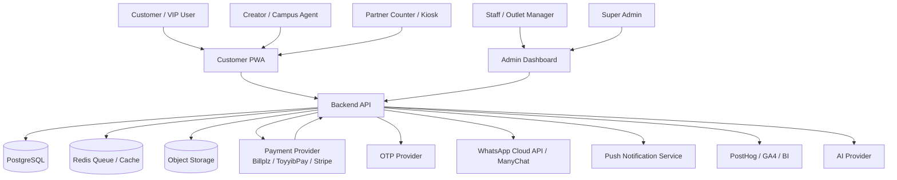

---

## 5. Deployment View

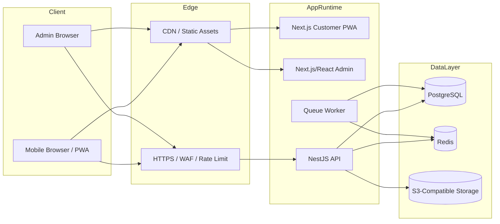

Recommended production setup for early stage:

| Component | Recommendation |
|---|---|
| Customer PWA | Hosted on Vercel, Cloudflare Pages, or VPS with Nginx. |
| Admin Dashboard | Same platform as PWA or internal subdomain. |
| API | Dockerized NestJS app on VPS/cloud service. |
| Worker | Separate process/container using same codebase. |
| Database | Managed PostgreSQL or VPS PostgreSQL with backup. |
| Redis | Managed Redis or containerized Redis. |
| Storage | Cloudflare R2, AWS S3, DigitalOcean Spaces or equivalent. |
| Monitoring | Sentry + uptime checks + structured logs. |

---

## 6. Application Boundaries

### 6.1 Frontend Apps

| App | Responsibility |
|---|---|
| Customer PWA | Customer ordering, wallet, referrals, drops, group orders and creator access. |
| Admin Dashboard | Internal operations, product setup, orders, campaigns, referrals, payouts, inventory and reports. |

### 6.2 Backend API

The backend owns all business-critical logic:

- Authentication/session validation.
- Role-based access control.
- Product and availability rules.
- Cart pricing and voucher validation.
- Payment state handling.
- Order lifecycle.
- Wallet transactions.
- Referral attribution.
- Creator commission calculation.
- Campaign eligibility.
- Fraud checks.
- Notification triggers.
- Audit logs.

### 6.3 Worker Process

The worker handles background jobs:

- Send WhatsApp notifications.
- Send push notifications.
- Generate share posters.
- Process payment webhooks asynchronously if needed.
- Calculate reward events after order completion.
- Release or reverse pending commissions.
- Run scheduled voucher expiry jobs.
- Generate daily reports.
- Fraud scoring jobs.

---

## 7. Modular Monolith Design

The backend should be split by domain modules, not by technical layers only.

```text
apps/api/src/modules/
├── auth/
├── users/
├── roles/
├── outlets/
├── products/
├── inventory/
├── cart/
├── orders/
├── payments/
├── wallet/
├── vouchers/
├── referrals/
├── ranks/
├── campaigns/
├── drops/
├── group-orders/
├── creators/
├── partners/
├── payouts/
├── ugc/
├── notifications/
├── ai/
├── fraud/
├── analytics/
├── audit/
└── admin/
```

### 7.1 Module Responsibility Matrix

| Module | Responsibilities | Must Not Do |
|---|---|---|
| Auth | OTP, sessions, tokens, auth guards. | Calculate rewards or order prices. |
| Users | Profiles, preferences, birthday, user metadata. | Manage permissions directly without roles module. |
| Roles | RBAC, role assignment, permissions. | Store customer profile data. |
| Products | Products, categories, images, availability rules. | Manage order status. |
| Inventory | Stock by outlet/drop/partner. | Handle payment capture. |
| Cart | Cart items, temporary pricing preview. | Finalize payment or rewards. |
| Orders | Order lifecycle, order items, status transitions. | Directly mutate wallet without wallet service. |
| Payments | Payment intent, webhook verification, payment states. | Change order status without order service. |
| Wallet | Coins, stamps, vouchers, freebie vault, transaction ledger. | Attribute referrals. |
| Referrals | DOWG Codes, attribution, referral events. | Pay out commissions directly. |
| Campaigns | Campaign rules, eligibility, voucher/drop configuration. | Store long-term wallet balances. |
| Drops | Limited drops, waitlist, stock meter, early access. | General product catalogue management. |
| Creators | Creator applications, profile, code, analytics. | Change payment provider state. |
| Payouts | Payout requests, approvals, payout status. | Calculate original commission without commission service. |
| Partners | Partner counters, stock movement, settlement. | Normal customer checkout UX. |
| Fraud | Fraud rules, flags, risk scores, review queue. | Make irreversible reward/payment changes without domain services. |
| Audit | Immutable admin/system logs. | Main application state changes. |

---

## 8. Domain Model Overview

### 8.1 Main Entities

```mermaid
erDiagram
    USERS ||--o{ USER_ROLES : has
    ROLES ||--o{ USER_ROLES : assigned
    USERS ||--|| USER_PROFILES : owns
    USERS ||--o{ ORDERS : places
    USERS ||--|| WALLETS : owns
    USERS ||--o{ USER_VOUCHERS : receives
    USERS ||--o{ REFERRAL_CODES : owns
    USERS ||--o{ REFERRAL_EVENTS : participates
    USERS ||--o{ CREATOR_APPLICATIONS : submits
    USERS ||--o{ CREATOR_PROFILES : may_have

    OUTLETS ||--o{ PRODUCT_AVAILABILITY : offers
    OUTLETS ||--o{ INVENTORY_ITEMS : stocks
    OUTLETS ||--o{ ORDERS : fulfills

    PRODUCTS ||--o{ PRODUCT_IMAGES : has
    PRODUCTS ||--o{ PRODUCT_AVAILABILITY : available_as
    PRODUCTS ||--o{ ORDER_ITEMS : ordered_as
    PRODUCT_CATEGORIES ||--o{ PRODUCTS : contains

    ORDERS ||--o{ ORDER_ITEMS : contains
    ORDERS ||--o{ PAYMENTS : paid_by
    ORDERS ||--o{ REFUNDS : may_have
    ORDERS ||--o{ WALLET_TRANSACTIONS : may_trigger
    ORDERS ||--o{ COMMISSIONS : may_trigger

    WALLETS ||--o{ WALLET_TRANSACTIONS : records
    VOUCHERS ||--o{ USER_VOUCHERS : assigned_as
    REFERRAL_CODES ||--o{ REFERRAL_EVENTS : tracks
    REFERRAL_EVENTS ||--o{ REFERRAL_REWARDS : triggers

    CAMPAIGNS ||--o{ CAMPAIGN_ASSETS : includes
    CAMPAIGNS ||--o{ VOUCHERS : creates
    CAMPAIGNS ||--o{ COMMISSIONS : may_generate

    DROPS ||--o{ DROP_WAITLISTS : has
    USERS ||--o{ DROP_WAITLISTS : joins

    CREATOR_PROFILES ||--o{ COMMISSIONS : earns
    CREATOR_PROFILES ||--o{ PAYOUT_REQUESTS : requests

    PARTNERS ||--o{ PARTNER_STOCK_MOVEMENTS : records
    PARTNERS ||--o{ SETTLEMENTS : receives

    USERS ||--o{ UGC_SUBMISSIONS : submits
    USERS ||--o{ TASTE_PROFILES : owns
    USERS ||--o{ NOTIFICATIONS : receives
    USERS ||--o{ FRAUD_FLAGS : may_have
```

---

## 9. Database Design Principles

### 9.1 Ledger-First Wallet

Wallet balances should be derived from transaction records or kept as cached balances with strict transaction consistency.

Required wallet fields:

| Field | Purpose |
|---|---|
| `wallet_id` | Unique wallet ID. |
| `user_id` | Wallet owner. |
| `coin_balance` | Current available coins. |
| `cash_balance` | Store credit only, if enabled. |
| `stamp_balance` | Current stamp progress or derive separately. |
| `created_at` / `updated_at` | Audit timestamps. |

Required wallet transaction fields:

| Field | Purpose |
|---|---|
| `type` | `coin_earn`, `coin_redeem`, `voucher_reward`, `stamp_earn`, `cash_credit`, `adjustment`, `reversal`. |
| `amount` | Positive or negative value. |
| `reference_type` | `order`, `referral`, `campaign`, `admin_adjustment`, `refund`. |
| `reference_id` | ID of source entity. |
| `idempotency_key` | Prevent duplicate transactions. |
| `status` | `pending`, `posted`, `reversed`. |

### 9.2 Payment State Separation

Orders and payments should have separate statuses.

**Order statuses:**

```text
pending_payment
paid
accepted
preparing
ready
completed
cancelled
refunded
failed
```

**Payment statuses:**

```text
created
pending
paid
failed
expired
refunded
partially_refunded
```

Never assume order completion just because payment succeeds. The system should mark paid order first, then staff/admin completes fulfillment.

### 9.3 Idempotency

The system must use idempotency for:

- Checkout creation.
- Payment webhook processing.
- Wallet reward posting.
- Referral reward creation.
- Commission creation.
- Payout status updates.

Example key format:

```text
payment_webhook:{provider}:{provider_payment_id}:{event_type}
wallet_reward:order:{order_id}:first_order
referral_reward:{referral_event_id}:completed_order
commission:{order_id}:{creator_id}
```

---

## 10. Core Flows

## 10.1 Authentication Flow

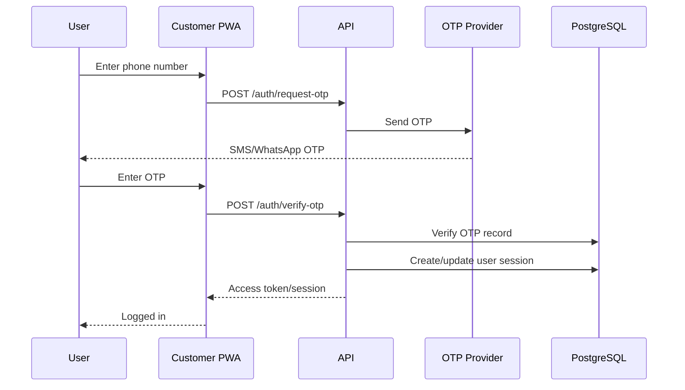

Security requirements:

- OTP expiry, e.g. 5 minutes.
- Rate limit per phone/IP/device.
- Do not reveal whether phone exists.
- Store OTP hash, not plain OTP.
- Log failed attempts.

---

## 10.2 Checkout + Payment Flow

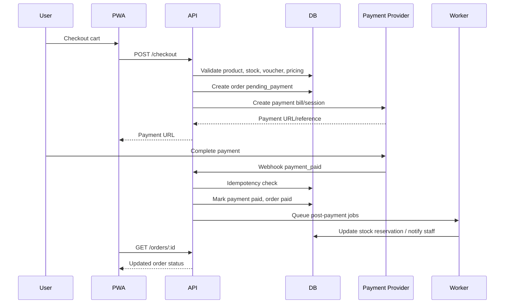

Critical rules:

- Final price must be calculated on the backend.
- Voucher must be locked or consumed safely.
- Stock must be reserved or validated before payment.
- Webhooks must be signed and idempotent.
- Payment success should not directly post referral rewards until order is completed.

---

## 10.3 Order Fulfillment Flow

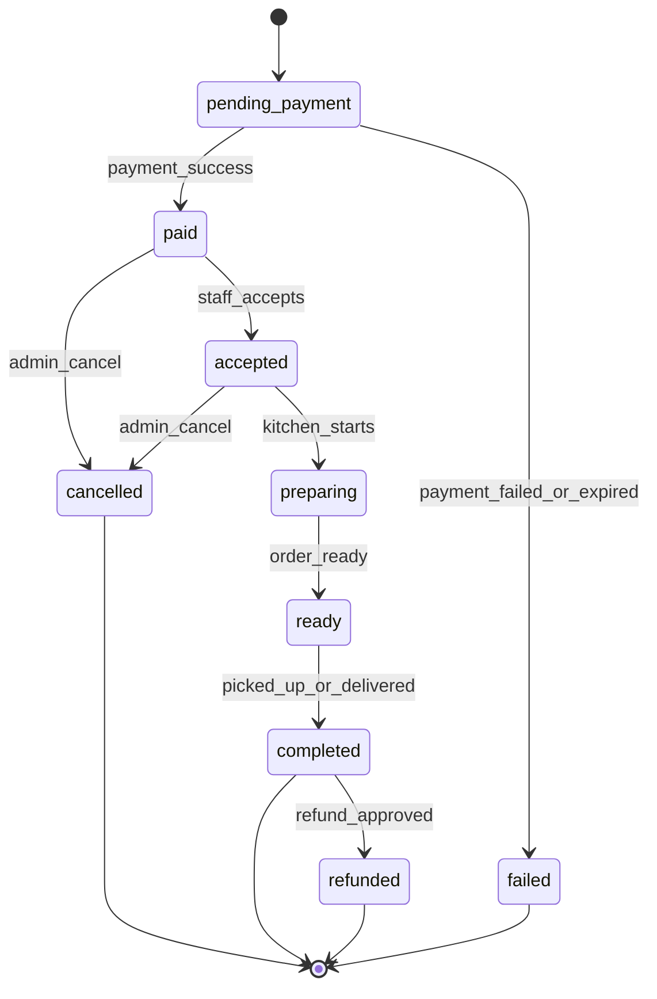

Reward posting should happen after `completed`, not only `paid`, unless DOWGNUT intentionally decides a different rule.

---

## 10.4 Referral Attribution Flow

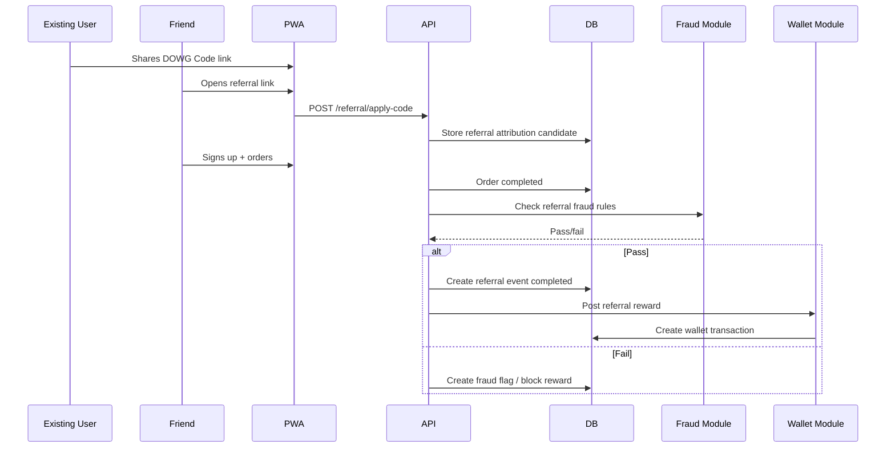

Referral attribution priority should be explicit:

1. Last valid referral code before signup, if still within attribution window.
2. Creator code applied at checkout, if active.
3. Admin/manual campaign assignment, if applicable.

Avoid double-paying unless campaign rules explicitly allow stacking.

---

## 10.5 Wallet Transaction Flow

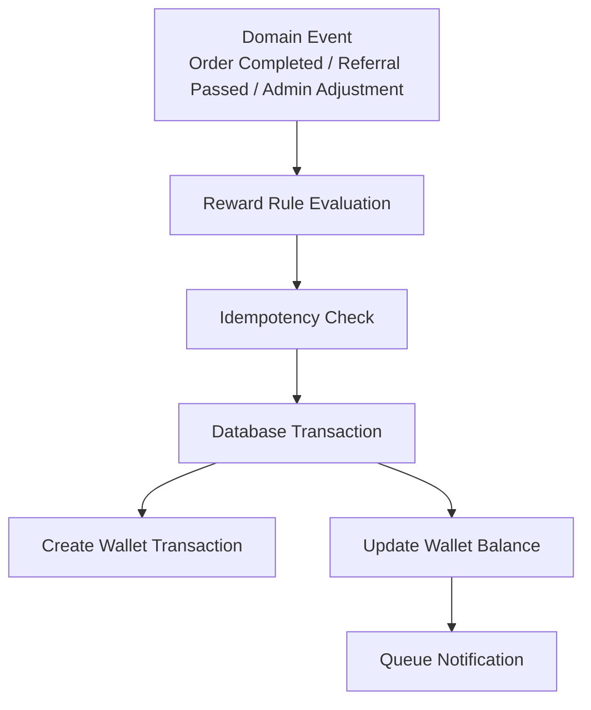

Wallet rules:

- All wallet mutations must go through wallet service.
- Never update wallet balance directly from controllers.
- Always create a transaction log.
- Reversals should create reversing transactions, not delete history.
- Admin adjustments require reason and audit log.

---

## 10.6 Creator Commission Flow

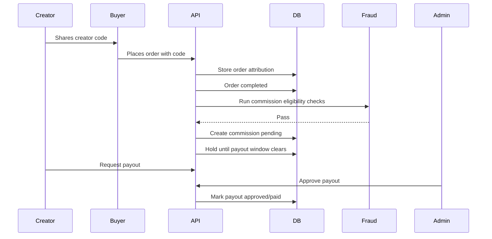

Commission status lifecycle:

```text
pending → approved → payout_requested → paid
pending → rejected
approved → reversed
```

---

## 10.7 Secret Drop Flow

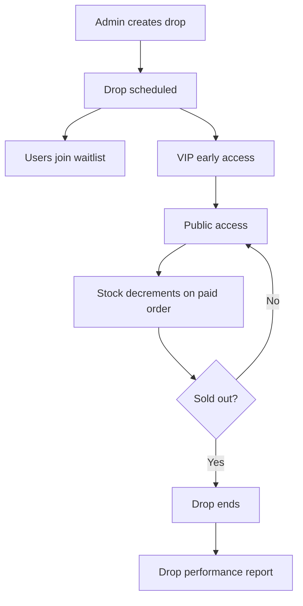

Drop constraints:

- Limited stock must be enforced server-side.
- Countdown is frontend display only; backend is source of truth.
- VIP early access must check user rank/eligibility.
- Waitlist join does not guarantee stock unless reservation is implemented.

---

## 10.8 Group Order / Box Party Flow

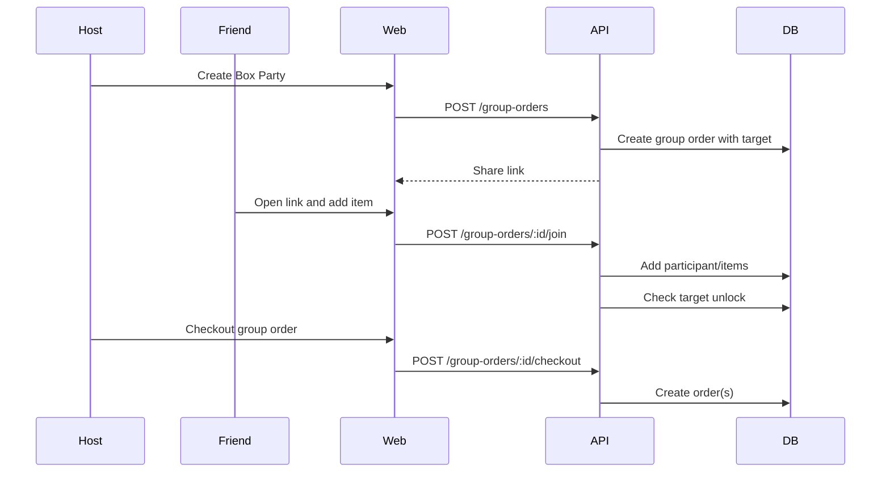

Payment options:

| Option | Pros | Cons |
|---|---|---|
| Host pays all | Simple fulfillment. | Host has to collect money manually. |
| Each participant pays | Cleaner collection. | More complex checkout and failure handling. |
| Hybrid | Flexible. | More complex UX. |

MVP recommendation: **Host pays all** first.

---

## 11. API Architecture

### 11.1 API Style

Recommended:

- RESTful JSON APIs.
- Version prefix: `/v1`.
- OpenAPI/Swagger documentation.
- Consistent response envelope.
- Cursor pagination for list endpoints.
- Server-side validation.
- Explicit error codes.

Example success response:

```json
{
  "success": true,
  "data": {},
  "meta": {
    "request_id": "req_123"
  }
}
```

Example error response:

```json
{
  "success": false,
  "error": {
    "code": "VOUCHER_NOT_ELIGIBLE",
    "message": "This voucher cannot be used for this order."
  },
  "meta": {
    "request_id": "req_123"
  }
}
```

### 11.2 Endpoint Groups

```http
# Auth
POST   /v1/auth/request-otp
POST   /v1/auth/verify-otp
POST   /v1/auth/logout
GET    /v1/auth/me
PATCH  /v1/auth/me

# Products
GET    /v1/products
GET    /v1/products/:id
GET    /v1/outlets/:outlet_id/products
POST   /v1/admin/products
PATCH  /v1/admin/products/:id
DELETE /v1/admin/products/:id

# Checkout / Orders
POST   /v1/cart
PATCH  /v1/cart/:id
POST   /v1/checkout
GET    /v1/orders
GET    /v1/orders/:id
POST   /v1/orders/:id/reorder
PATCH  /v1/admin/orders/:id/status

# Wallet / Rewards
GET    /v1/wallet
GET    /v1/wallet/transactions
GET    /v1/vouchers
POST   /v1/vouchers/redeem
GET    /v1/stamps
GET    /v1/ranks/me

# Referral
GET    /v1/referral/me
POST   /v1/referral/apply-code
GET    /v1/referral/events
GET    /v1/referral/share-poster
GET    /v1/admin/referrals
POST   /v1/admin/referrals/reverse

# Creator
POST   /v1/creator/apply
GET    /v1/creator/dashboard
GET    /v1/creator/campaigns
GET    /v1/creator/commissions
POST   /v1/creator/payouts
GET    /v1/creator/payouts
PATCH  /v1/admin/creator-applications/:id
PATCH  /v1/admin/creators/:id/status

# Drops
GET    /v1/drops
GET    /v1/drops/:id
POST   /v1/drops/:id/waitlist
POST   /v1/admin/drops
PATCH  /v1/admin/drops/:id

# Group Orders
POST   /v1/group-orders
GET    /v1/group-orders/:id
POST   /v1/group-orders/:id/join
POST   /v1/group-orders/:id/checkout

# AI
POST   /v1/ai/flavor-match
POST   /v1/ai/build-box
POST   /v1/ai/caption-generator

# Admin Reports
GET    /v1/admin/reports/sales
GET    /v1/admin/reports/referrals
GET    /v1/admin/reports/creators
GET    /v1/admin/reports/drops
```

---

## 12. Authentication & Authorization

### 12.1 Authentication Methods

MVP recommendation:

- Phone OTP login for customers.
- Email/password or SSO for admins, protected by MFA if possible.
- Session/JWT-based auth.

### 12.2 Role-Based Access Control

Permissions should be checked server-side.

| Permission | Customer | Creator | Partner | Staff | Manager | Super Admin |
|---|---:|---:|---:|---:|---:|---:|
| View menu | ✅ | ✅ | ✅ | ✅ | ✅ | ✅ |
| Place order | ✅ | ✅ | ✅ | ✅ | ✅ | ✅ |
| View own wallet | ✅ | ✅ | ❌ | ❌ | ❌ | ✅ |
| View creator dashboard | ❌ | ✅ | ❌ | ❌ | ❌ | ✅ |
| View partner dashboard | ❌ | ❌ | ✅ | ❌ | ✅ | ✅ |
| Manage orders | ❌ | ❌ | Limited | ✅ | ✅ | ✅ |
| Manage products | ❌ | ❌ | ❌ | ❌ | ✅ | ✅ |
| Manage campaigns | ❌ | ❌ | ❌ | ❌ | Limited | ✅ |
| Approve payouts | ❌ | ❌ | ❌ | ❌ | Limited | ✅ |
| View fraud dashboard | ❌ | ❌ | ❌ | ❌ | Limited | ✅ |

### 12.3 Admin Security

- Separate admin login URL/subdomain.
- Strong password policy if password-based.
- MFA recommended.
- IP allowlist optional for HQ/admin.
- Audit every admin mutation.

---

## 13. Campaign & Voucher Architecture

Campaigns should be rule-based and configurable.

### 13.1 Campaign Entity

Campaign fields:

| Field | Purpose |
|---|---|
| `name` | Human-readable campaign name. |
| `type` | `first_purchase`, `referral`, `drop`, `creator`, `birthday`, `group_order`. |
| `status` | `draft`, `active`, `paused`, `ended`. |
| `start_at`, `end_at` | Campaign schedule. |
| `eligibility_rules` | JSON rules for users/products/outlets. |
| `reward_rules` | JSON rules for reward issuance. |
| `budget_limit` | Optional max campaign cost. |
| `max_redemptions` | Global cap. |
| `created_by` | Admin user. |

### 13.2 Voucher Rules

Voucher validation must check:

- Voucher active status.
- User ownership.
- Expiry.
- Product/category eligibility.
- Outlet eligibility.
- Minimum spend.
- New-user-only restriction.
- Max redemption count.
- Stackability.
- Fraud flags.

### 13.3 Pricing Calculation Order

Recommended order:

```text
1. Load cart items
2. Validate product availability and stock
3. Calculate subtotal
4. Apply product-level discounts
5. Apply voucher if eligible
6. Apply delivery/service fee
7. Calculate tax if required
8. Calculate final payable amount
9. Create order/payment record
```

The frontend can show estimates, but the backend owns final pricing.

---

## 14. Payment Architecture

### 14.1 Payment Provider Abstraction

Create a payment provider interface so DOWGNUT can switch or add providers.

```ts
interface PaymentProvider {
  createPayment(input: CreatePaymentInput): Promise<CreatePaymentResult>;
  verifyWebhook(headers: unknown, body: unknown): Promise<VerifiedPaymentEvent>;
  refundPayment(input: RefundPaymentInput): Promise<RefundPaymentResult>;
}
```

Supported initial providers:

- Billplz.
- ToyyibPay.
- Manual payment proof for early offline/booth testing.
- Stripe if needed for card or international.

### 14.2 Webhook Requirements

- Verify provider signature where available.
- Store raw webhook event for audit.
- Use idempotency key.
- Do not trust frontend payment success redirect.
- Reconcile provider status with internal payment status.
- Queue downstream jobs after successful payment.

### 14.3 Manual Payment Mode

Useful for early testing, but must be controlled:

- User uploads proof or admin marks payment received.
- Admin action creates audit log.
- Manual payment orders should be flagged.
- Rewards may require completed status and admin approval.

---

## 15. Notification Architecture

### 15.1 Channels

| Channel | Use Case |
|---|---|
| In-app | Wallet updates, order status, drop alerts. |
| WhatsApp | Order confirmation, pickup notice, voucher reminder, referral share. |
| Push notification | Drop countdown, reward expiry, reorder reminder. |
| Email | Admin reports, optional receipts, payout statements. |

### 15.2 Notification Events

| Event | Channel |
|---|---|
| OTP sent | SMS/WhatsApp |
| Order paid | In-app + WhatsApp |
| Order ready | In-app + WhatsApp/push |
| Reward earned | In-app + push |
| Voucher expiring | Push/WhatsApp |
| Drop starting soon | Push |
| Friend used DOWG Code | In-app |
| Creator commission approved | In-app/email |
| Payout status updated | In-app/email |

### 15.3 Notification Table

Store every notification attempt:

| Field | Purpose |
|---|---|
| `user_id` | Recipient. |
| `channel` | `in_app`, `whatsapp`, `push`, `email`. |
| `event_type` | Source event. |
| `status` | `queued`, `sent`, `failed`, `read`. |
| `provider_message_id` | External provider reference. |
| `payload` | JSON payload. |
| `sent_at` | Send timestamp. |

---

## 16. Analytics Architecture

### 16.1 Event Tracking

Track product and growth events using PostHog/GA4 and internal events.

Important events:

```text
user_signed_up
otp_verified
first_voucher_claimed
product_viewed
cart_created
checkout_started
payment_completed
order_completed
wallet_reward_earned
referral_code_shared
referral_code_applied
referred_user_order_completed
creator_code_used
drop_viewed
drop_waitlist_joined
group_order_created
group_order_joined
voucher_redeemed
```

### 16.2 Internal Reporting Tables

For business-critical reporting, do not rely only on third-party analytics. Store internal aggregates or build reporting queries from transactional data.

Required reports:

- Daily sales.
- Sales by product.
- Sales by outlet.
- Campaign performance.
- Referral conversion.
- Creator sales/commission.
- Repeat purchase.
- Voucher cost.
- Drop performance.
- Fraud flags.

---

## 17. Fraud & Risk Architecture

### 17.1 Fraud Flag Entity

| Field | Purpose |
|---|---|
| `user_id` | Related user. |
| `order_id` | Related order, optional. |
| `referral_event_id` | Related referral, optional. |
| `type` | `self_referral`, `voucher_farming`, `payment_cluster`, `refund_abuse`, `creator_spam`. |
| `severity` | `low`, `medium`, `high`, `critical`. |
| `status` | `open`, `reviewing`, `resolved`, `dismissed`. |
| `details` | JSON evidence. |

### 17.2 MVP Fraud Rules

| Rule | Action |
|---|---|
| Same phone as referrer and referred | Block reward. |
| Same verified user tries own code | Block reward. |
| Referred order cancelled/refunded | Reverse reward. |
| Multiple accounts on same device/payment | Flag for review. |
| Too many first-voucher uses from same IP/device | Rate limit / flag. |
| Creator code used in suspicious internal orders | Hold commission. |

### 17.3 Payout Hold

Creator commission should have a configurable hold period, e.g. 7–14 days, before payout approval. This reduces refund and fake-order abuse.

---

## 18. AI Architecture

AI is not required for MVP, but the architecture should leave clean extension points.

### 18.1 AI Features

| Feature | Input | Output |
|---|---|---|
| Flavor Match | Taste quiz, past orders, mood. | Recommended donut/box. |
| Smart Box Builder | Budget, flavour preference, group size. | Suggested box combination. |
| Caption Generator | Creator campaign, product, tone. | TikTok/IG/WhatsApp captions. |
| WhatsApp Seller Bot | Customer questions and menu data. | Guided reply + order link. |

### 18.2 AI Safety Rules

- AI must not invent prices, stock or promotions.
- AI recommendations must use current product/menu data.
- AI output for creators should avoid prohibited earning claims.
- Store AI logs for improvement and troubleshooting.
- Do not send unnecessary personal data to AI provider.

### 18.3 AI Module Boundary

The AI module should call internal product/campaign APIs before generating content. It should not directly access raw database tables from prompt code.

---

## 19. Storage Architecture

Use object storage for:

- Product images.
- Campaign assets.
- Creator promo kits.
- UGC submissions.
- Generated referral posters.
- Receipts/invoices if needed.

Storage rules:

- Use signed upload URLs for user-generated uploads.
- Validate file type and size.
- Process images for web-friendly size.
- Keep original and optimized versions where useful.
- Do not expose private files publicly without signed URL.

---

## 20. Observability

### 20.1 Logging

Use structured logs with:

- `request_id`
- `user_id`, if available
- `role`
- `module`
- `action`
- `entity_id`
- `status`
- `duration_ms`

Never log OTP codes, full tokens, payment secrets or sensitive personal data.

### 20.2 Monitoring

Monitor:

- API error rate.
- Payment webhook failures.
- Queue job failures.
- Database slow queries.
- Order completion delays.
- Notification failures.
- Fraud flag spikes.
- Payout queue status.

### 20.3 Alerts

Set alerts for:

- Payment webhook error spike.
- Queue worker down.
- Database unavailable.
- Admin login brute force.
- High checkout failure rate.
- High refund/cancel rate.

---

## 21. Reliability & Scalability

### 21.1 MVP Scalability Assumptions

Early target:

- 1–5 outlets/booths.
- Hundreds to low thousands of users.
- Dozens to hundreds of daily orders.
- Small creator/agent base.

Architecture should still support growth to:

- Multi-outlet operations.
- Campaign spikes during drops.
- Viral referral bursts.
- Group order peaks.

### 21.2 Scaling Strategy

| Bottleneck | Strategy |
|---|---|
| Heavy frontend traffic | CDN + static caching. |
| API traffic | Horizontal scale API containers. |
| Payment webhooks | Queue + idempotency. |
| Notification volume | Queue workers with retry/backoff. |
| Reports slow queries | Read replicas or materialized views later. |
| Image traffic | CDN-backed object storage. |
| Drop stock race condition | DB transactions/row locks/reservation system. |

### 21.3 Race Conditions to Protect

- Limited drop stock decrement.
- Voucher max redemption cap.
- One reward per referral event.
- One commission per attributed order/creator.
- Wallet balance updates.
- Payment webhook duplicate events.

Use database transactions and unique constraints.

---

## 22. Data Privacy & Compliance

### 22.1 Personal Data Collected

Potential data:

- Phone number.
- Name/nickname.
- Email, optional.
- Birthday, optional.
- Order history.
- Delivery/pickup location, if applicable.
- Referral relationships.
- Creator payout details, if enabled.

### 22.2 Privacy Principles

- Collect only necessary data.
- Explain how referral tracking works.
- Allow users to request account deletion/export where required.
- Protect phone numbers and payout details.
- Keep access to personal data role-limited.
- Do not expose referral graph publicly.

### 22.3 Compliance Guardrail for Earn System

DOWGNUT CLUB™ should separate:

| User Type | Public Language | Reward Type |
|---|---|---|
| Normal customer | Refer friends, unlock rewards. | Voucher, points, free item, store credit. |
| Creator | Creator code / campaign commission. | Direct commission from own attributed sales. |
| Agent/partner | Partner margin / sales settlement. | Margin or approved payout. |

Avoid public recruitment-based income claims without legal review.

---

## 23. Admin Dashboard Architecture

### 23.1 Admin Areas

| Area | Key Features |
|---|---|
| Overview | GMV, orders, active campaigns, alerts. |
| Orders | Queue, status updates, cancellation/refund notes. |
| Products | Product CRUD, images, categories, availability. |
| Inventory | Outlet stock, drop stock, stock movements. |
| Campaigns | Vouchers, referral campaigns, drops, group order promos. |
| Users | User search, wallet view, role assignment. |
| Referrals | Events, rewards, blocked/self-referral flags. |
| Creators | Applications, code status, commissions, payout requests. |
| Partners | Partner stock, QR sales, settlement. |
| Reports | Sales, product, creator, campaign, wallet liability. |
| Fraud | Flags, review queue, manual decisions. |
| Audit Logs | Admin/system changes. |

### 23.2 Admin Mutation Rule

Any admin action that changes money/rewards/orders must:

1. Require permission.
2. Validate input.
3. Create audit log.
4. Use domain service.
5. Be reversible where possible.

---

## 24. Frontend Architecture

### 24.1 Customer PWA Feature Structure

```text
apps/web/src/
├── app/
│   ├── page.tsx
│   ├── menu/
│   ├── product/[id]/
│   ├── cart/
│   ├── checkout/
│   ├── orders/
│   ├── wallet/
│   ├── refer/
│   ├── drops/
│   ├── group-orders/
│   └── creator/
├── components/
│   ├── ui/
│   ├── brand/
│   ├── product/
│   ├── wallet/
│   └── referral/
├── features/
│   ├── auth/
│   ├── menu/
│   ├── cart/
│   ├── checkout/
│   ├── wallet/
│   ├── referral/
│   ├── drops/
│   └── creator/
└── lib/
    ├── api-client.ts
    ├── auth.ts
    ├── analytics.ts
    └── constants.ts
```

### 24.2 UI State Management

Recommended:

- Server state: TanStack Query or SWR.
- Local UI state: React state/Zustand.
- Cart: backend-backed for logged-in users; local temporary cart for guests if needed.
- Auth: secure session handling.

### 24.3 Frontend Rules

- Do not calculate final price exclusively on frontend.
- Do not trust frontend wallet/reward values.
- Show backend validation messages clearly.
- Persist referral code from URL through signup/checkout.
- Make share actions native-friendly on mobile.

---

## 25. Backend Architecture

### 25.1 Layering Inside Each Module

Recommended NestJS module pattern:

```text
module/
├── controllers/     # HTTP endpoints
├── services/        # Business logic
├── repositories/    # DB access abstraction if needed
├── dto/             # Request/response validation
├── entities/        # ORM models/types if applicable
├── events/          # Domain events
├── jobs/            # Queue processors/producers
└── tests/
```

### 25.2 Controller Rule

Controllers should be thin:

```text
validate request
→ call service
→ return response
```

Business rules belong in services.

### 25.3 Domain Events

Use domain events internally for decoupling:

```text
OrderPaid
OrderCompleted
OrderCancelled
PaymentWebhookReceived
ReferralCandidateCreated
ReferralRewardApproved
WalletTransactionPosted
CreatorCommissionCreated
VoucherRedeemed
DropSoldOut
```

These can first be implemented as in-process events + queue jobs, then moved to a message broker later if needed.

---

## 26. Queue & Job Architecture

### 26.1 Job Types

| Queue | Jobs |
|---|---|
| `notifications` | WhatsApp, push, email. |
| `payments` | Webhook reconciliation, refund sync. |
| `rewards` | Wallet posting, referral reward, stamp reward. |
| `commissions` | Commission hold release, payout status update. |
| `media` | Image optimization, share poster generation. |
| `reports` | Daily sales reports, campaign summaries. |
| `fraud` | Risk score calculation, suspicious pattern detection. |

### 26.2 Retry Policy

| Job Type | Retry Strategy |
|---|---|
| Notification | 3 retries with exponential backoff. |
| Payment reconciliation | 5 retries + manual alert. |
| Wallet posting | Must be idempotent; retry safely. |
| Poster generation | Retry 2–3 times, non-critical. |
| Report generation | Retry once then log failure. |

---

## 27. Future Evolution Path

### 27.1 When to Split Services

Only split into separate services when there is a real operational need.

Possible future service split:

| Future Service | Reason to Split |
|---|---|
| Notification service | High message volume. |
| Payment service | Multi-provider complexity. |
| Rewards service | High transaction volume and audit requirements. |
| Analytics service | Heavy reporting workload. |
| AI service | Separate model/provider management. |

### 27.2 Native App Path

After PWA traction is proven:

- Keep backend APIs unchanged.
- Build React Native or Flutter mobile app.
- Reuse shared types and design tokens.
- Keep PWA as acquisition/QR landing channel.

---

## 28. Architecture Decision Records

### ADR-001 — Use PWA First

**Decision:** Start with PWA, not native app.  
**Reason:** Faster QR onboarding, lower cost, easier iteration, works from WhatsApp/IG/TikTok.  
**Tradeoff:** Native push and app-store presence are weaker initially.

### ADR-002 — Modular Monolith Backend

**Decision:** Use modular monolith for MVP.  
**Reason:** Easier to build and debug; enough scale for early phase.  
**Tradeoff:** Requires discipline to keep module boundaries clean.

### ADR-003 — Ledger-Based Wallet

**Decision:** Wallet changes must be transaction logged.  
**Reason:** Rewards, reversals, commissions and audits require traceability.  
**Tradeoff:** More implementation work than simple balance update.

### ADR-004 — Reward After Completed Order

**Decision:** Referral/customer rewards trigger after completed paid order, not only payment.  
**Reason:** Reduces fake orders and refund abuse.  
**Tradeoff:** Customer sees reward later; UI must explain pending status.

### ADR-005 — Customer Rewards Are Not Public Cash MLM

**Decision:** Normal customer referrals use vouchers, coins, stamps or store credit.  
**Reason:** Cleaner compliance and simpler positioning.  
**Tradeoff:** Less aggressive than cash income claims, but safer and brand-friendly.

---

## 29. Implementation Priority

### P0 — Must Build First

- Auth + OTP.
- User profile.
- Product catalogue.
- Cart + checkout.
- Payment/webhook handling.
- Order management.
- Wallet ledger.
- Voucher system.
- DOWG Code referral.
- Admin dashboard basics.
- Audit logs.
- Basic fraud rules.

### P1 — Viral Growth

- Creator application/approval.
- Creator code analytics.
- Commission ledger.
- Drop countdown and waitlist.
- Box Party group order.
- Push/WhatsApp notification flows.
- Basic leaderboards.

### P2 — Scale

- Partner counter dashboard.
- Multi-outlet inventory.
- Advanced fraud scoring.
- UGC challenge workflow.
- Reports and campaign attribution.
- AI flavour match and caption generator.

---

## 30. Final Architecture Principle

Every feature should support one of these loops:

```text
Order Loop      → user buys again
Referral Loop   → user brings another user
Creator Loop    → creator brings audience
Drop Loop       → scarcity creates urgency
Group Loop      → one buyer brings many buyers
Partner Loop    → one location creates offline scale
```

If a proposed feature does not strengthen one of these loops, it should wait until after MVP. 🍩🚀


---

## Hermes Agent AI Layer

DOWGNUT CLUB™ can integrate Hermes Agent as an AI operating layer, but Hermes should sit behind the DOWGNUT backend rather than being called directly by public clients.

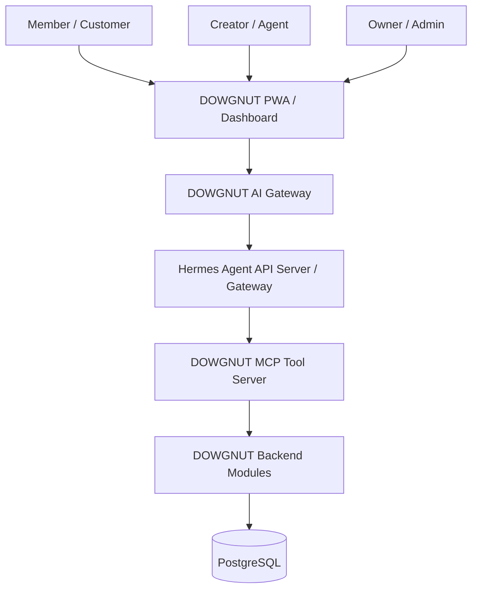

### AI Role Boundaries

| Role | Assistant | Tool Access |
|---|---|---|
| Member | DOWG Buddy | Menu, drops, own wallet, own order status, voucher explanation, support tickets. |
| Creator | DOWG Creator Coach | Own campaigns, own performance, own payout status, content/caption generation. |
| Owner | DOWGNUT Operator | Reports, product analytics, inventory alerts, campaign drafts, fraud flags, approval-based writes. |

### Security Position

- Browser calls DOWGNUT backend only.
- Backend calls Hermes server-to-server.
- Hermes calls DOWGNUT systems only through filtered MCP tools.
- Public profiles must not expose terminal tools.
- Owner write actions require approval records and audit logs.

Detailed specification: [`HERMES_AGENT_INTEGRATION.md`](./HERMES_AGENT_INTEGRATION.md).
